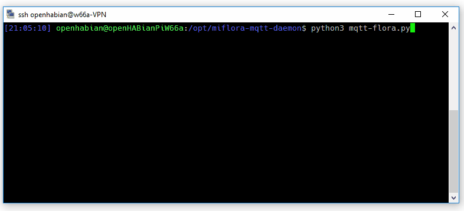

# Xiaomi Mi Flora Plant Sensor MQTT Client/Daemon

A simple Linux python script to query arbitrary Mi Flora plant sensor devices and send the data to an **MQTT** broker,
e.g., the famous [Eclipse Mosquitto](https://projects.eclipse.org/projects/technology.mosquitto) or the embedded MQTT broker in [Home Assistant](https://home-assistant.io). After data made the hop to the MQTT broker it can be used by home automation software like Home Assistant or [openHAB](https://openhab.org).



The program can be executed for a single run or in **daemon mode** to run continuously in the background.

### Features

* Support for [Xiaomi Mi Flora sensors](https://www.aliexpress.com/item/Newest-Original-Xiaomi-Flora-Monitor-Digital-Plants-Flowers-Soil-Water-Light-Tester-Sensor-Monitor-for-Aquarium/32685750372.html) (tested with firmware v2.6.2, v2.6.4, v2.6.6, others anticipated)
* Build on top of [open-homeautomation/miflora](https://github.com/open-homeautomation/miflora)
* Highly configurable
* Data publication via MQTT
* JSON encoded
* MQTT authentication support
* Daemon mode (default)
* Reliable and inituitive

### Installation

Shown for a modern Debian system:

```shell
git clone https://github.com/janwh/miflora-mqtt-daemon.git /opt/miflora-mqtt-daemon
cd /opt/miflora-mqtt-daemon

apt install python3 python3-pip bluetooth libbluetooth-dev libboost-python-dev libglib2.0-dev
pip3 install -r requirements.txt
```

### Configuration

To match personal needs all operation details can be configured using the file [`config.ini`](config.ini).

You need to add at least one sensor to the configuration.
Scan for available Miflora sensors in your proximity with the command:

```shell
hcitool lescan
```

### Execution

A first test run is as easy as:

```shell
python3 mqtt-flora.py
```

With a correct configuration the result should look similar to the the screencap above.
The extensive output can be reduced to error messages:

```shell
python3 mqtt-flora.py > /dev/null
```

You probably want to execute the program **continuously in the background**.
This can either be done by using the internal daemon or cron.

**Attention:** Daemon mode can be enabled (default) and disabled in the config file.

1. Send the program into the background with some simple command line foo:
   
   ```shell
   python3 /path/to/mqtt-flora.py &
   ```
   
   *Hint:* Bring back to foreground with `fg`.

2. Screen Shell - Run the program inside a [screen shell](https://www.howtoforge.com/linux_screen):
   
   ```shell
   screen -S mqtt-flora -d -m python3 /path/to/mqtt-flora.py
   ```

3. Cron job - Add a new con job, e.g., `/etc/cron.d/miflora`, execute every 5 minutes
   
   ```shell
   */5 * * * * root python3 /path/to/mqtt-flora.py > /dev/null
   ```

### Integration

Data will be published to the MQTT broker topic "`miflora/sensorname`" (names configurable).
An example:

```json
{"light": 24, "moisture": 30, "temperature": 21.4, "conductivity": 1020, "battery": 100}
```

This data can be subscribed to and processed by other applications, like [Home Assistant](https://home-assistant.io) or [openHAB](https://openhab.org).

Enjoy!

----

#### Disclaimer and Legal

> *Xiaomi* and *Mi Flora* are registered trademarks of *BEIJING XIAOMI TECHNOLOGY CO., LTD.*
> 
> This project is a community project not for commercial use.
> 
> This project is in no way affiliated with, authorized, maintained, sponsored or endorsed by *Xiaomi* or any of its affiliates or subsidiaries.

